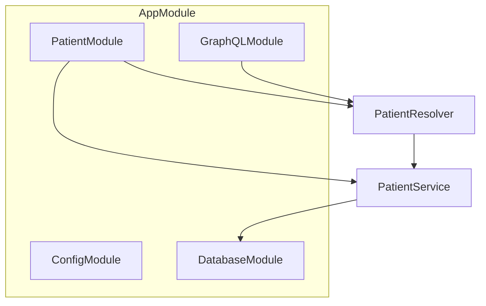

<p align="center">
  <a href="http://nestjs.com/" target="blank"></a>
</p>

[circleci-image]: https://img.shields.io/circleci/build/github/nestjs/nest/master?token=abc123def456
[circleci-url]: https://circleci.com/gh/nestjs/nest

  <p align="center">A progressive <a href="http://nodejs.org" target="_blank">Node.js</a> framework for building efficient and scalable server-side applications.</p>
    <p align="center">
<a href="https://www.npmjs.com/~nestjscore" target="_blank"></a>
<a href="https://www.npmjs.com/~nestjscore" target="_blank"></a>
<a href="https://www.npmjs.com/~nestjscore" target="_blank"></a>
<a href="https://circleci.com/gh/nestjs/nest" target="_blank"></a>
<a href="https://discord.gg/G7Qnnhy" target="_blank"></a>
<a href="https://opencollective.com/nest#backer" target="_blank"></a>
<a href="https://opencollective.com/nest#sponsor" target="_blank"></a>
  <a href="https://paypal.me/kamilmysliwiec" target="_blank"></a>
    <a href="https://opencollective.com/nest#sponsor"  target="_blank"></a>
  <a href="https://twitter.com/nestframework" target="_blank"></a>
</p>
  <!--[](https://opencollective.com/nest#backer)
  [](https://opencollective.com/nest#sponsor)-->

# Patient Management Backend

A NestJS backend application with GraphQL API and SQLite database for patient management.

## Features

- GraphQL API with Apollo Server
- SQLite database using TypeORM
- Patient CRUD operations
- Auto-generated GraphQL schema
- HIPAA-compliant data modeling with field-level security
- Health check endpoint for monitoring

## API Endpoints

### Health Check
- **GET** `/health` - Application health status
  ```json
  {
    "status": "ok",
    "timestamp": "2025-06-22T14:26:56.311Z",
    "service": "Patient Management API",
    "version": "1.0.0"
  }
  ```

### GraphQL
- **POST** `/graphql` - GraphQL API endpoint
- **GET** `/graphql` - GraphQL Playground (when `APP_ENV=local`)

## Architecture Overview

This project uses a modular NestJS architecture with TypeORM for database access and GraphQL for the API layer.

### Module Structure

- **AppModule**: Root module, imports all other modules and sets up global configuration.
- **PatientModule**: Encapsulates all patient-related logic (resolvers, services).
- **PatientResolver**: Handles GraphQL queries and mutations for patients.
- **PatientService**: Contains business logic and uses TypeORM for database access.
- **DatabaseModule**: Sets up TypeORM connection and entities.
- **TypeORM Entity**: Defines the database structure and models.

### Patient Query Flow

1. **Client** sends a GraphQL query to `/graphql`.
2. **GraphQLModule** routes the query to `PatientResolver`.
3. **PatientResolver** calls `PatientService.findAll()`.
4. **PatientService** uses TypeORM Repository to fetch data from the database.
5. **Data** is returned to the client in the GraphQL response.

### Mermaid Diagram



## Database & Field-Level Security

The application uses **TypeORM** for database access and migrations. Sensitive fields (e.g., SSN, medical record number) are protected at the entity level using `select: false`:

```typescript
@Column({ nullable: true, select: false })
ssn?: string;
```

By default, these fields are not returned in queries unless explicitly selected, supporting HIPAA compliance.

## TypeORM Migrations & Database Management

### Migration Commands

```bash
# Generate a new migration after changing entities
npm run migration:generate -- src/migrations/InitialMigration

# Run all pending migrations
npm run migration:run

# Revert the last migration
npm run migration:revert

# Show migration status
npm run migration:show

# Sync schema (development only)
npm run schema:sync

# Drop schema (development only)
npm run schema:drop
```

### Example Entity

```typescript
import { Entity, PrimaryGeneratedColumn, Column, CreateDateColumn, UpdateDateColumn } from 'typeorm';
import { ObjectType, Field, Int } from '@nestjs/graphql';

@Entity('patients')
@ObjectType()
export class Patient {
  @PrimaryGeneratedColumn()
  @Field(() => Int)
  id: number;

  @Column()
  @Field()
  firstName: string;

  @Column()
  @Field()
  lastName: string;

  @Column({ unique: true })
  @Field()
  email: string;

  @Column()
  @Field()
  phone: string;

  @Column('datetime')
  @Field()
  dateOfBirth: Date;

  @Column({ nullable: true, select: false })
  ssn?: string;

  // ... other fields ...
}
```

## Example Query

```graphql
query {
  patients {
    id
    firstName
    lastName
    email
    # ssn, medicalRecordNumber, etc. are NOT exposed by default
  }
}
```

## Installation

```bash
npm install
```

## Running the app

```bash
# development
npm run start

# watch mode
npm run start:dev

# production mode
npm run start:prod
```

## Docker

This application is containerized with Docker for easy deployment and development.

### 🐳 **Docker Features**

- **Multi-stage build** for optimized production images
- **Node.js 22 Alpine** for smaller, secure images
- **Non-root user** for security
- **Health checks** for container orchestration
- **Volume persistence** for SQLite database
- **Development and production** configurations

### 🚀 **Quick Start with Docker**

#### **Production Build**
```bash
# Build the Docker image
npm run docker:build

# Run the container
npm run docker:run

# Or use docker-compose (recommended)
npm run docker:compose:up
```

#### **Development with Docker**
```bash
# Run development environment
npm run docker:compose:dev

# View logs
npm run docker:logs
```

### 📋 **Docker Commands**

#### **Build & Run**
```bash
# Build production image
docker build -t patient-management-api .

# Run container
docker run -p 3000:3000 patient-management-api
```

#### **Docker Compose**
```bash
# Start production services
docker-compose up -d

# Start development environment
docker-compose --profile dev up -d

# View logs
docker-compose logs -f

# Stop services
docker-compose down

# Rebuild and start
docker-compose up -d --build
```

#### **Database Management**
```bash
# Run migrations in container
docker-compose exec patient-management-api npm run migration:run

# Generate a new migration in container
docker-compose exec patient-management-api npm run migration:generate -- src/migrations/SomeMigration

# Revert last migration
docker-compose exec patient-management-api npm run migration:revert
```

### 🔧 **Docker Configuration**

#### **Dockerfile Stages**
1. **Base**: Node.js 22 Alpine base image
2. **Deps**: Install production dependencies
3. **Builder**: Build TypeScript
4. **Runner**: Production image with non-root user

#### **Environment Variables**
```bash
NODE_ENV=production          # Node environment
APP_ENV=production           # Application environment
PORT=3000                    # Application port
```

#### **Volumes**
- `patient-db`: Persists SQLite database across container restarts

#### **Networks**
- `patient-network`: Isolated network for the application

### 🏥 **Health Checks**

The container includes health checks that verify:
- Application is responding on port 3000
- Health endpoint returns 200 status
- Service is ready to handle requests

```bash
# Check container health
docker inspect patient-management-api | grep Health -A 10

# Manual health check
curl http://localhost:3000/health
```

### 🔒 **Security Features**

- **Non-root user**: Application runs as `nestjs` user (UID 1001)
- **Alpine Linux**: Minimal attack surface
- **Multi-stage build**: No build tools in production image
- **Read-only filesystem**: Where possible
- **No secrets in image**: Use environment variables

### 📦 **Image Optimization**

- **Multi-stage build** reduces final image size
- **Alpine Linux** base (~5MB vs ~300MB for Ubuntu)
- **Production-only dependencies** in final image
- **Layer caching** for faster rebuilds

### 🚀 **Deployment Examples**

#### **Local Development**
```bash
# Start development environment
npm run docker:compose:dev

# Access GraphQL Playground
open http://localhost:3001/graphql

# View logs
npm run docker:logs
```

#### **Production Deployment**
```bash
# Build and start production
npm run docker:compose:up

# Access API
curl http://localhost:3000/health

# Run migrations
docker-compose exec patient-management-api npm run migration:run
```

#### **Kubernetes Deployment**
```yaml
apiVersion: apps/v1
kind: Deployment
metadata:
  name: patient-management-api
spec:
  replicas: 3
  selector:
    matchLabels:
      app: patient-management-api
  template:
    metadata:
      labels:
        app: patient-management-api
    spec:
      containers:
      - name: patient-management-api
        image: patient-management-api:latest
        ports:
        - containerPort: 3000
        env:
        - name: NODE_ENV
          value: "production"
        - name: APP_ENV
          value: "production"
        livenessProbe:
          httpGet:
            path: /health
            port: 3000
          initialDelaySeconds: 30
          periodSeconds: 10
        readinessProbe:
          httpGet:
            path: /health
            port: 3000
          initialDelaySeconds: 5
          periodSeconds: 5
```

### 🧹 **Cleanup**

```bash
# Stop and remove containers
npm run docker:stop

# Remove all containers and images
docker-compose down --rmi all --volumes

# Clean up Docker system
npm run docker:clean
```

## GraphQL API

The GraphQL playground is available at: http://localhost:3000/graphql

### Available Queries

- `patients`: Get all patients
- `patient(id: Int!)`: Get a specific patient by ID
- `patientWithSensitiveData(id: Int!)`: Get a patient with sensitive fields (for authorized use)

### Available Mutations

- `createPatient(createPatientInput: CreatePatientInput!)`: Create a new patient
- `updatePatient(id: Int!, updatePatientInput: UpdatePatientInput!)`: Update an existing patient
- `deletePatient(id: Int!)`: Delete a patient

### Example Queries

```graphql
# Get all patients
query {
  patients {
    id
    firstName
    lastName
    email
    phone
    dateOfBirth
    createdAt
    updatedAt
  }
}

# Get a specific patient
query {
  patient(id: 1) {
    id
    firstName
    lastName
    email
  }
}

# Create a new patient
mutation {
  createPatient(createPatientInput: {
    firstName: "John"
    lastName: "Doe"
    email: "john.doe@example.com"
    phone: "+1234567890"
    dateOfBirth: "1990-01-01T00:00:00.000Z"
  }) {
    id
    firstName
    lastName
    email
  }
}
```

## Database

The application uses SQLite with the database file `patients.db` created automatically in the project root. All schema and migration management is handled by TypeORM.

## Test

```bash
# unit tests
npm run test

# e2e tests
npm run test:e2e

# test coverage
npm run test:cov
```

## Deployment

When you're ready to deploy your NestJS application to production, there are some key steps you can take to ensure it runs as efficiently as possible. Check out the [deployment documentation](https://docs.nestjs.com/deployment) for more information.

If you are looking for a cloud-based platform to deploy your NestJS application, check out [Mau](https://mau.nestjs.com), our official platform for deploying NestJS applications on AWS. Mau makes deployment straightforward and fast, requiring just a few simple steps:

```bash
$ npm install -g @nestjs/mau
$ mau deploy
```

With Mau, you can deploy your application in just a few clicks, allowing you to focus on building features rather than managing infrastructure.

## Resources

Check out a few resources that may come in handy when working with NestJS:

- Visit the [NestJS Documentation](https://docs.nestjs.com) to learn more about the framework.
- For questions and support, please visit our [Discord channel](https://discord.gg/G7Qnnhy).
- To dive deeper and get more hands-on experience, check out our official video [courses](https://courses.nestjs.com/).
- Deploy your application to AWS with the help of [NestJS Mau](https://mau.nestjs.com) in just a few clicks.
- Visualize your application graph and interact with the NestJS application in real-time using [NestJS Devtools](https://devtools.nestjs.com).
- Need help with your project (part-time to full-time)? Check out our official [enterprise support](https://enterprise.nestjs.com).
- To stay in the loop and get updates, follow us on [X](https://x.com/nestframework) and [LinkedIn](https://linkedin.com/company/nestjs).
- Looking for a job, or have a job to offer? Check out our official [Jobs board](https://jobs.nestjs.com).

## Support

Nest is an MIT-licensed open source project. It can grow thanks to the sponsors and support by the amazing backers. If you'd like to join them, please [read more here](https://docs.nestjs.com/support).

## Stay in touch

- Author - [Kamil Myśliwiec](https://twitter.com/kammysliwiec)
- Website - [https://nestjs.com](https://nestjs.com/)
- Twitter - [@nestframework](https://twitter.com/nestframework)

## License

Nest is [MIT licensed](https://github.com/nestjs/nest/blob/master/LICENSE).

## Prisma Migrations & Database Management

### Common Commands

- **Create & apply a new migration (development):**
  ```bash
  npm run prisma:migrate -- --name <migration_name>
  ```
- **Apply migrations in production:**
  ```bash
  npm run prisma:migrate:deploy
  ```
- **Check migration status:**
  ```bash
  npm run prisma:migrate:status
  ```
- **Open Prisma Studio (GUI for DB):**
  ```bash
  npm run prisma:studio
  ```
- **Reset the database (dev only!):**
  ```bash
  npm run prisma:reset
  ```
- **Regenerate Prisma Client:**
  ```bash
  npm run prisma:generate
  ```

### Example Migration Workflow

1. **Edit your Prisma schema:**
   - Open `prisma/schema.prisma` and make your changes (e.g., add a field).
2. **Create and apply a migration:**
   ```bash
   npm run prisma:migrate -- --name add-gender-to-patient
   ```
3. **Check the generated migration in `prisma/migrations/` and commit it to version control.**
4. **Deploy migrations in production:**
   ```bash
   npm run prisma:migrate:deploy
   ```

> **Tip:** Always use migrations (not `db push`) in production for safe, trackable schema changes.

## Logging and Trace ID

This project uses a static logger facade (`AppLogger`) with automatic trace ID injection for every request. You do **not** need to inject a logger or trace service—just import and use it anywhere!

### How It Works
- Every HTTP request gets a unique trace ID (or uses the incoming one).
- All logs for that request automatically include the trace ID.
- The trace ID is returned in the response header (`X-Trace-ID`).
- You can use `AppLogger` anywhere (controller, service, utility, etc.).

### Usage Example

```typescript
import { AppLogger } from './common/logging/app-logger';

// Log an info message (traceId is included automatically)
AppLogger.info('Patient created', { patientId: 123 });

// Log an error
AppLogger.error('Failed to create patient', { error });

// Log with custom context
AppLogger.info('User login', { userId: user.id, ip: req.ip });

// You can use AppLogger in any file, function, or static context!
```

### How to Add More Context
If you want to add more information (like user ID, organization, etc.) to every log for a request, update the context in the `TraceInterceptor` or create a custom context store in `log-context.ts`.
