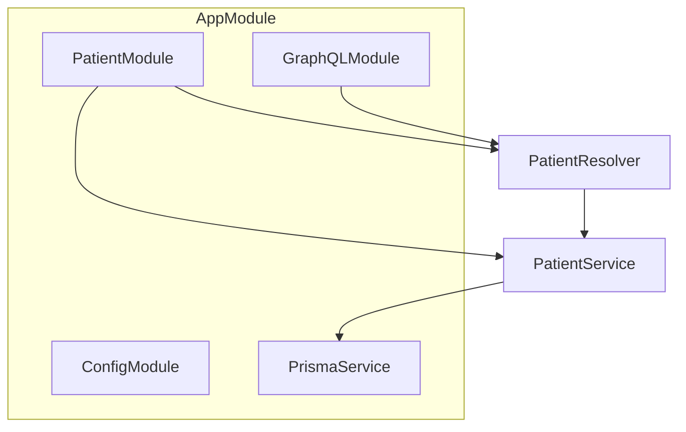

<p align="center">
  <a href="http://nestjs.com/" target="blank"></a>
</p>

[circleci-image]: https://img.shields.io/circleci/build/github/nestjs/nest/master?token=abc123def456
[circleci-url]: https://circleci.com/gh/nestjs/nest

  <p align="center">A progressive <a href="http://nodejs.org" target="_blank">Node.js</a> framework for building efficient and scalable server-side applications.</p>
    <p align="center">
<a href="https://www.npmjs.com/~nestjscore" target="_blank"></a>
<a href="https://www.npmjs.com/~nestjscore" target="_blank"></a>
<a href="https://www.npmjs.com/~nestjscore" target="_blank"></a>
<a href="https://circleci.com/gh/nestjs/nest" target="_blank"></a>
<a href="https://discord.gg/G7Qnnhy" target="_blank"></a>
<a href="https://opencollective.com/nest#backer" target="_blank"></a>
<a href="https://opencollective.com/nest#sponsor" target="_blank"></a>
  <a href="https://paypal.me/kamilmysliwiec" target="_blank"></a>
    <a href="https://opencollective.com/nest#sponsor"  target="_blank"></a>
  <a href="https://twitter.com/nestframework" target="_blank"></a>
</p>
  <!--[](https://opencollective.com/nest#backer)
  [](https://opencollective.com/nest#sponsor)-->

# Patient Management Backend

A NestJS backend application with GraphQL API and SQLite database for patient management.

## Features

- GraphQL API with Apollo Server
- SQLite database using Prisma ORM
- Patient CRUD operations
- Auto-generated GraphQL schema
- HIPAA-compliant data modeling

## Architecture Overview

This project uses a modular NestJS architecture with Prisma ORM for database access and GraphQL for the API layer.

### Module Structure

- **AppModule**: Root module, imports all other modules and sets up global configuration.
- **PatientModule**: Encapsulates all patient-related logic (resolvers, services).
- **PatientResolver**: Handles GraphQL queries and mutations for patients.
- **PatientService**: Contains business logic and uses Prisma for database access.
- **PrismaService**: Wraps Prisma Client for dependency injection.
- **Prisma Schema**: Defines the database structure and models.

### Patient Query Flow

1. **Client** sends a GraphQL query to `/graphql`.
2. **GraphQLModule** routes the query to `PatientResolver`.
3. **PatientResolver** calls `PatientService.findAll()`.
4. **PatientService** uses `PrismaService` to fetch data from the database.
5. **Data** is returned to the client in the GraphQL response.

### Mermaid Diagram



## Prisma Schema Example

```prisma
model Patient {
  id                    Int      @id @default(autoincrement())
  firstName            String
  lastName             String
  email                String   @unique
  phone                String
  dateOfBirth          DateTime
  ssn                  String?  // Sensitive field - optional for HIPAA compliance
  medicalRecordNumber  String?  // Sensitive field - optional for HIPAA compliance
  address              String?
  emergencyContact     String?
  insuranceProvider    String?
  insuranceNumber      String?  // Sensitive field
  allergies            String?
  medications          String?
  medicalHistory       String?  // Sensitive field
  createdAt            DateTime @default(now())
  updatedAt            DateTime @updatedAt
  createdBy            String?
  lastModifiedBy       String?
  organizationId       String?  // For multi-tenant security
  @@map("patients")
}
```

## Sample Code

### PrismaService
```typescript
// src/prisma/prisma.service.ts
import { Injectable, OnModuleInit } from '@nestjs/common';
import { PrismaClient } from '@prisma/client';

@Injectable()
export class PrismaService extends PrismaClient implements OnModuleInit {
  async onModuleInit() {
    await this.$connect();
  }
}
```

### PatientService
```typescript
// src/patient/patient.service.ts
import { Injectable } from '@nestjs/common';
import { PrismaService } from '../prisma/prisma.service';
import { Prisma, Patient } from '@prisma/client';

@Injectable()
export class PatientService {
  constructor(private prisma: PrismaService) {}

  async findAll(): Promise<Patient[]> {
    // Only return non-sensitive fields by default
    return this.prisma.patient.findMany({
      select: {
        id: true,
        firstName: true,
        lastName: true,
        email: true,
        phone: true,
        dateOfBirth: true,
        createdAt: true,
        updatedAt: true,
      },
    });
  }

  async findOne(id: number, includeSensitive = false): Promise<Patient | null> {
    return this.prisma.patient.findUnique({
      where: { id },
      select: includeSensitive
        ? undefined // All fields
        : {
            id: true,
            firstName: true,
            lastName: true,
            email: true,
            phone: true,
            dateOfBirth: true,
            createdAt: true,
            updatedAt: true,
          },
    });
  }

  async create(data: Prisma.PatientCreateInput): Promise<Patient> {
    return this.prisma.patient.create({ data });
  }

  async update(id: number, data: Prisma.PatientUpdateInput): Promise<Patient> {
    return this.prisma.patient.update({ where: { id }, data });
  }

  async delete(id: number): Promise<Patient> {
    return this.prisma.patient.delete({ where: { id } });
  }
}
```

### PatientResolver
```typescript
// src/patient/patient.resolver.ts
import { Resolver, Query, Mutation, Args, Int } from '@nestjs/graphql';
import { PatientService } from './patient.service';
import { Patient } from '@prisma/client';

@Resolver('Patient')
export class PatientResolver {
  constructor(private readonly patientService: PatientService) {}

  @Query(() => [Patient])
  async patients(): Promise<Patient[]> {
    return this.patientService.findAll();
  }

  @Query(() => Patient, { nullable: true })
  async patient(@Args('id', { type: () => Int }) id: number): Promise<Patient | null> {
    // Only include sensitive fields if user is authorized (add your guard/logic here)
    return this.patientService.findOne(id, /* includeSensitive= */ false);
  }

  @Mutation(() => Patient)
  async createPatient(@Args('data') data: any): Promise<Patient> {
    return this.patientService.create(data);
  }

  @Mutation(() => Patient)
  async updatePatient(
    @Args('id', { type: () => Int }) id: number,
    @Args('data') data: any,
  ): Promise<Patient> {
    return this.patientService.update(id, data);
  }

  @Mutation(() => Patient)
  async deletePatient(@Args('id', { type: () => Int }) id: number): Promise<Patient> {
    return this.patientService.delete(id);
  }
}
```

## How to Use

1. **Install dependencies**
   ```bash
   npm install
   ```
2. **Set up the database**
   ```bash
   npx prisma generate
   npx prisma db push
   ```
3. **Start the server**
   ```bash
   npm run start:dev
   ```
4. **Access GraphQL Playground**
   - Open [http://localhost:3000/graphql](http://localhost:3000/graphql)

## Security & HIPAA Compliance

- Use Prisma's field selection and access control to protect sensitive data.
- Use role-based guards in resolvers to restrict access to PHI.
- Use audit logging for sensitive data access.
- Encrypt sensitive fields as needed.

## Example Query

```graphql
query {
  patients {
    id
    firstName
    lastName
    email
    # ssn, dateOfBirth, medicalRecordNumber are NOT exposed by default
  }
}
```

---

For more details, see the code and comments in each module!

## Installation

```bash
npm install
```

## Running the app

```bash
# development
npm run start

# watch mode
npm run start:dev

# production mode
npm run start:prod
```

## GraphQL API

The GraphQL playground is available at: http://localhost:3000/graphql

### Available Queries

- `patients`: Get all patients
- `patient(id: Int!)`: Get a specific patient by ID

### Available Mutations

- `createPatient(createPatientInput: CreatePatientInput!)`: Create a new patient
- `updatePatient(id: Int!, updatePatientInput: UpdatePatientInput!)`: Update an existing patient
- `deletePatient(id: Int!)`: Delete a patient

### Example Queries

```graphql
# Get all patients
query {
  patients {
    id
    firstName
    lastName
    email
    phone
    dateOfBirth
    createdAt
    updatedAt
  }
}

# Get a specific patient
query {
  patient(id: 1) {
    id
    firstName
    lastName
    email
  }
}

# Create a new patient
mutation {
  createPatient(createPatientInput: {
    firstName: "John"
    lastName: "Doe"
    email: "john.doe@example.com"
    phone: "+1234567890"
    dateOfBirth: "1990-01-01T00:00:00.000Z"
  }) {
    id
    firstName
    lastName
    email
  }
}
```

## Database

The application uses SQLite with the database file `patients.db` created automatically in the project root.

## Test

```bash
# unit tests
npm run test

# e2e tests
npm run test:e2e

# test coverage
npm run test:cov
```

## Deployment

When you're ready to deploy your NestJS application to production, there are some key steps you can take to ensure it runs as efficiently as possible. Check out the [deployment documentation](https://docs.nestjs.com/deployment) for more information.

If you are looking for a cloud-based platform to deploy your NestJS application, check out [Mau](https://mau.nestjs.com), our official platform for deploying NestJS applications on AWS. Mau makes deployment straightforward and fast, requiring just a few simple steps:

```bash
$ npm install -g @nestjs/mau
$ mau deploy
```

With Mau, you can deploy your application in just a few clicks, allowing you to focus on building features rather than managing infrastructure.

## Resources

Check out a few resources that may come in handy when working with NestJS:

- Visit the [NestJS Documentation](https://docs.nestjs.com) to learn more about the framework.
- For questions and support, please visit our [Discord channel](https://discord.gg/G7Qnnhy).
- To dive deeper and get more hands-on experience, check out our official video [courses](https://courses.nestjs.com/).
- Deploy your application to AWS with the help of [NestJS Mau](https://mau.nestjs.com) in just a few clicks.
- Visualize your application graph and interact with the NestJS application in real-time using [NestJS Devtools](https://devtools.nestjs.com).
- Need help with your project (part-time to full-time)? Check out our official [enterprise support](https://enterprise.nestjs.com).
- To stay in the loop and get updates, follow us on [X](https://x.com/nestframework) and [LinkedIn](https://linkedin.com/company/nestjs).
- Looking for a job, or have a job to offer? Check out our official [Jobs board](https://jobs.nestjs.com).

## Support

Nest is an MIT-licensed open source project. It can grow thanks to the sponsors and support by the amazing backers. If you'd like to join them, please [read more here](https://docs.nestjs.com/support).

## Stay in touch

- Author - [Kamil Myśliwiec](https://twitter.com/kammysliwiec)
- Website - [https://nestjs.com](https://nestjs.com/)
- Twitter - [@nestframework](https://twitter.com/nestframework)

## License

Nest is [MIT licensed](https://github.com/nestjs/nest/blob/master/LICENSE).

## Prisma Migrations & Database Management

### Common Commands

- **Create & apply a new migration (development):**
  ```bash
  npm run prisma:migrate -- --name <migration_name>
  ```
- **Apply migrations in production:**
  ```bash
  npm run prisma:migrate:deploy
  ```
- **Check migration status:**
  ```bash
  npm run prisma:migrate:status
  ```
- **Open Prisma Studio (GUI for DB):**
  ```bash
  npm run prisma:studio
  ```
- **Reset the database (dev only!):**
  ```bash
  npm run prisma:reset
  ```
- **Regenerate Prisma Client:**
  ```bash
  npm run prisma:generate
  ```

### Example Migration Workflow

1. **Edit your Prisma schema:**
   - Open `prisma/schema.prisma` and make your changes (e.g., add a field).
2. **Create and apply a migration:**
   ```bash
   npm run prisma:migrate -- --name add-gender-to-patient
   ```
3. **Check the generated migration in `prisma/migrations/` and commit it to version control.**
4. **Deploy migrations in production:**
   ```bash
   npm run prisma:migrate:deploy
   ```

> **Tip:** Always use migrations (not `db push`) in production for safe, trackable schema changes.
