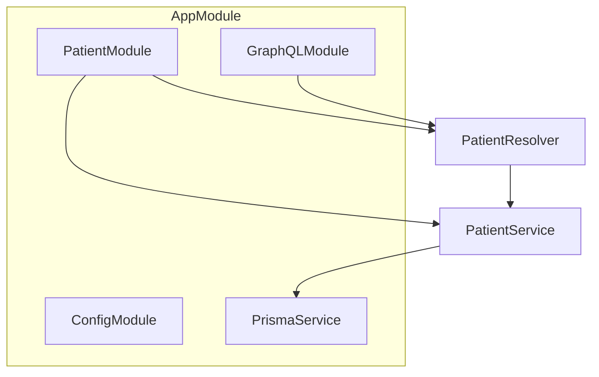

<p align="center">
  <a href="http://nestjs.com/" target="blank"></a>
</p>

[circleci-image]: https://img.shields.io/circleci/build/github/nestjs/nest/master?token=abc123def456
[circleci-url]: https://circleci.com/gh/nestjs/nest

  <p align="center">A progressive <a href="http://nodejs.org" target="_blank">Node.js</a> framework for building efficient and scalable server-side applications.</p>
    <p align="center">
<a href="https://www.npmjs.com/~nestjscore" target="_blank"></a>
<a href="https://www.npmjs.com/~nestjscore" target="_blank"></a>
<a href="https://www.npmjs.com/~nestjscore" target="_blank"></a>
<a href="https://circleci.com/gh/nestjs/nest" target="_blank"></a>
<a href="https://discord.gg/G7Qnnhy" target="_blank"></a>
<a href="https://opencollective.com/nest#backer" target="_blank"></a>
<a href="https://opencollective.com/nest#sponsor" target="_blank"></a>
  <a href="https://paypal.me/kamilmysliwiec" target="_blank"></a>
    <a href="https://opencollective.com/nest#sponsor"  target="_blank"></a>
  <a href="https://twitter.com/nestframework" target="_blank"></a>
</p>
  <!--[](https://opencollective.com/nest#backer)
  [](https://opencollective.com/nest#sponsor)-->

# Patient Management Backend

A NestJS backend application with GraphQL API and SQLite database for patient management.

## Features

- GraphQL API with Apollo Server
- SQLite database using Prisma ORM
- Patient CRUD operations
- Auto-generated GraphQL schema
- HIPAA-compliant data modeling
- Health check endpoint for monitoring

## API Endpoints

### Health Check
- **GET** `/health` - Application health status
  ```json
  {
    "status": "ok",
    "timestamp": "2025-06-22T14:26:56.311Z",
    "service": "Patient Management API",
    "version": "1.0.0"
  }
  ```

### GraphQL
- **POST** `/graphql` - GraphQL API endpoint
- **GET** `/graphql` - GraphQL Playground (when `APP_ENV=local`)

## Architecture Overview

This project uses a modular NestJS architecture with Prisma ORM for database access and GraphQL for the API layer.

### Module Structure

- **AppModule**: Root module, imports all other modules and sets up global configuration.
- **PatientModule**: Encapsulates all patient-related logic (resolvers, services).
- **PatientResolver**: Handles GraphQL queries and mutations for patients.
- **PatientService**: Contains business logic and uses Prisma for database access.
- **PrismaService**: Wraps Prisma Client for dependency injection.
- **Prisma Schema**: Defines the database structure and models.

### Patient Query Flow

1. **Client** sends a GraphQL query to `/graphql`.
2. **GraphQLModule** routes the query to `PatientResolver`.
3. **PatientResolver** calls `PatientService.findAll()`.
4. **PatientService** uses `PrismaService` to fetch data from the database.
5. **Data** is returned to the client in the GraphQL response.

### Mermaid Diagram



## Prisma Schema Example

```prisma
model Patient {
  id                    Int      @id @default(autoincrement())
  firstName            String
  lastName             String
  email                String   @unique
  phone                String
  dateOfBirth          DateTime
  ssn                  String?  // Sensitive field - optional for HIPAA compliance
  medicalRecordNumber  String?  // Sensitive field - optional for HIPAA compliance
  address              String?
  emergencyContact     String?
  insuranceProvider    String?
  insuranceNumber      String?  // Sensitive field
  allergies            String?
  medications          String?
  medicalHistory       String?  // Sensitive field
  createdAt            DateTime @default(now())
  updatedAt            DateTime @updatedAt
  createdBy            String?
  lastModifiedBy       String?
  organizationId       String?  // For multi-tenant security
  @@map("patients")
}
```

## Sample Code

### PrismaService
```typescript
// src/prisma/prisma.service.ts
import { Injectable, OnModuleInit } from '@nestjs/common';
import { PrismaClient } from '@prisma/client';

@Injectable()
export class PrismaService extends PrismaClient implements OnModuleInit {
  async onModuleInit() {
    await this.$connect();
  }
}
```

### PatientService
```typescript
// src/patient/patient.service.ts
import { Injectable } from '@nestjs/common';
import { PrismaService } from '../prisma/prisma.service';
import { Prisma, Patient } from '@prisma/client';

@Injectable()
export class PatientService {
  constructor(private prisma: PrismaService) {}

  async findAll(): Promise<Patient[]> {
    // Only return non-sensitive fields by default
    return this.prisma.patient.findMany({
      select: {
        id: true,
        firstName: true,
        lastName: true,
        email: true,
        phone: true,
        dateOfBirth: true,
        createdAt: true,
        updatedAt: true,
      },
    });
  }

  async findOne(id: number, includeSensitive = false): Promise<Patient | null> {
    return this.prisma.patient.findUnique({
      where: { id },
      select: includeSensitive
        ? undefined // All fields
        : {
            id: true,
            firstName: true,
            lastName: true,
            email: true,
            phone: true,
            dateOfBirth: true,
            createdAt: true,
            updatedAt: true,
          },
    });
  }

  async create(data: Prisma.PatientCreateInput): Promise<Patient> {
    return this.prisma.patient.create({ data });
  }

  async update(id: number, data: Prisma.PatientUpdateInput): Promise<Patient> {
    return this.prisma.patient.update({ where: { id }, data });
  }

  async delete(id: number): Promise<Patient> {
    return this.prisma.patient.delete({ where: { id } });
  }
}
```

### PatientResolver
```typescript
// src/patient/patient.resolver.ts
import { Resolver, Query, Mutation, Args, Int } from '@nestjs/graphql';
import { PatientService } from './patient.service';
import { Patient } from '@prisma/client';

@Resolver('Patient')
export class PatientResolver {
  constructor(private readonly patientService: PatientService) {}

  @Query(() => [Patient])
  async patients(): Promise<Patient[]> {
    return this.patientService.findAll();
  }

  @Query(() => Patient, { nullable: true })
  async patient(@Args('id', { type: () => Int }) id: number): Promise<Patient | null> {
    // Only include sensitive fields if user is authorized (add your guard/logic here)
    return this.patientService.findOne(id, /* includeSensitive= */ false);
  }

  @Mutation(() => Patient)
  async createPatient(@Args('data') data: any): Promise<Patient> {
    return this.patientService.create(data);
  }

  @Mutation(() => Patient)
  async updatePatient(
    @Args('id', { type: () => Int }) id: number,
    @Args('data') data: any,
  ): Promise<Patient> {
    return this.patientService.update(id, data);
  }

  @Mutation(() => Patient)
  async deletePatient(@Args('id', { type: () => Int }) id: number): Promise<Patient> {
    return this.patientService.delete(id);
  }
}
```

## Knowledge

This section explains key NestJS concepts and patterns used in this project.

### Dependency Injection & @Injectable() Decorator

The `@Injectable()` decorator is a **fundamental NestJS concept** that enables **dependency injection**. Here's what it does:

#### 🎯 **What `@Injectable()` Does**

1. **Marks the Class for DI Container**
   ```typescript
   @Injectable()
   export class AppService {
     getHealth() { /* ... */ }
   }
   ```
   The `@Injectable()` decorator tells NestJS:
   - "This class can be **injected** into other classes"
   - "This class can **receive** other injected dependencies"
   - "Register this class in the **dependency injection container**"

2. **Enables Constructor Injection**
   ```typescript
   @Controller()
   export class AppController {
     constructor(private readonly appService: AppService) {} // ✅ Works because AppService has @Injectable()
   }
   ```

3. **Manages Lifecycle**
   - **Singleton**: By default, creates one instance shared across the app
   - **Scoped**: Can be configured for different scopes (REQUEST, TRANSIENT)
   - **Memory Management**: NestJS handles instantiation and cleanup

#### 🔄 **How It Works in Your App**

**Step 1: Registration**
```typescript
@Module({
  providers: [AppService], // ✅ Registers AppService in DI container
})
export class AppModule {}
```

**Step 2: Injection**
```typescript
@Controller()
export class AppController {
  constructor(private readonly appService: AppService) {} // ✅ NestJS automatically provides AppService instance
}
```

**Step 3: Usage**
```typescript
@Get('health')
getHealth() {
  return this.appService.getHealth(); // ✅ Uses injected instance
}
```

#### 🏗️ **Dependency Injection Flow**

```mermaid
graph TD
    A[AppModule] --> B[DI Container]
    B --> C[AppService Instance]
    B --> D[AppController Instance]
    D --> E[Constructor: AppService]
    E --> C
    D --> F[Uses AppService.getHealth()]
```

#### 📚 **Real Examples from Your Codebase**

**AppService** (Injectable Provider)
```typescript
@Injectable() // ✅ Marks as injectable
export class AppService {
  getHealth() { /* ... */ }
}
```

**PatientService** (Injectable Provider)
```typescript
@Injectable() // ✅ Marks as injectable
export class PatientService {
  constructor(private prisma: PrismaService) {} // ✅ Can receive other injectables
}
```

**PatientResolver** (Injectable Consumer)
```typescript
@Resolver('Patient')
export class PatientResolver {
  constructor(private readonly patientService: PatientService) {} // ✅ Receives injected PatientService
}
```

#### 🎯 **Key Benefits**

1. **Loose Coupling**: Classes don't create their own dependencies
2. **Testability**: Easy to mock dependencies in unit tests
3. **Reusability**: Same instance shared across multiple consumers
4. **Configuration**: Centralized dependency management
5. **Lifecycle Management**: Automatic instantiation and cleanup

#### 🚫 **What Happens Without `@Injectable()`**

```typescript
// ❌ This would fail
export class AppService {
  getHealth() { return 'ok'; }
}

@Controller()
export class AppController {
  constructor(private appService: AppService) {} // ❌ NestJS can't inject this
}
```

**Error**: `Nest can't resolve dependencies of the AppController`

### Other Key NestJS Decorators

#### @Module()
- **Purpose**: Defines a module that encapsulates related functionality
- **Usage**: Groups controllers, providers, and imports
- **Example**: `AppModule`, `PatientModule`, `PrismaModule`

#### @Controller()
- **Purpose**: Defines a class that handles HTTP requests
- **Usage**: REST API endpoints
- **Example**: `AppController` with `/health` endpoint

#### @Resolver()
- **Purpose**: Defines a class that handles GraphQL queries and mutations
- **Usage**: GraphQL API endpoints
- **Example**: `PatientResolver` with patient CRUD operations

#### @Query() & @Mutation()
- **Purpose**: Defines GraphQL query and mutation methods
- **Usage**: Inside resolvers for specific operations
- **Example**: `patients()`, `createPatient()`, `updatePatient()`

#### @Args()
- **Purpose**: Extracts arguments from GraphQL queries/mutations
- **Usage**: Method parameters in resolvers
- **Example**: `@Args('id', { type: () => Int }) id: number`

### Module Architecture Pattern

NestJS uses a **modular architecture** where each module encapsulates related functionality:

```typescript
@Module({
  imports: [OtherModules],     // Dependencies from other modules
  controllers: [Controllers],  // HTTP/GraphQL request handlers
  providers: [Services],       // Business logic and data access
  exports: [Services],         // Services available to other modules
})
export class FeatureModule {}
```

### Dependency Injection Scopes & Levels

NestJS provides a **sophisticated hierarchical dependency injection system** with different scopes and levels:

#### 🏗️ **DI Hierarchy & Scopes**

##### 1. **Application-Wide (Singleton) - DEFAULT**
```typescript
@Injectable() // Default scope: SINGLETON
export class AppService {
  // One instance for the entire application
}
```

**Characteristics:**
- ✅ **One instance** shared across entire app
- ✅ **Memory efficient** - no duplication
- ✅ **State persists** between requests
- ⚠️ **Not thread-safe** for mutable state

##### 2. **Module-Wide (Singleton within Module)**
```typescript
@Module({
  providers: [
    {
      provide: 'DATABASE_CONNECTION',
      useValue: new DatabaseConnection(),
    },
  ],
})
export class DatabaseModule {}
```

**Characteristics:**
- ✅ **One instance per module**
- ✅ **Module encapsulation**
- ✅ **Can be imported by multiple modules**

##### 3. **Request-Wide (REQUEST Scope)**
```typescript
@Injectable({ scope: Scope.REQUEST })
export class UserService {
  constructor() {
    // New instance for each HTTP request
  }
}
```

**Characteristics:**
- 🔄 **New instance per request**
- 🔒 **Request isolation**
- 🎯 **Request-specific data**
- ⚠️ **Higher memory usage**

##### 4. **Transient (TRANSIENT Scope)**
```typescript
@Injectable({ scope: Scope.TRANSIENT })
export class LoggerService {
  constructor() {
    // New instance every time it's injected
  }
}
```

**Characteristics:**
- 🔄 **New instance every injection**
- 🔒 **Complete isolation**
- ⚠️ **Highest memory usage**

#### 📊 **Scope Comparison Table**

| Scope | Instance Lifecycle | Memory Usage | Use Case |
|-------|-------------------|--------------|----------|
| **SINGLETON** (default) | One per app | Low | Services, utilities |
| **REQUEST** | One per request | Medium | User context, request data |
| **TRANSIENT** | One per injection | High | Loggers, temporary services |

#### 🎯 **Real Examples from Your Codebase**

**Application-Wide Services**
```typescript
// src/app.service.ts
@Injectable() // Default: SINGLETON
export class AppService {
  // One instance shared across all modules
}

// src/patient/patient.service.ts
@Injectable() // Default: SINGLETON
export class PatientService {
  // One instance shared across all resolvers
}
```

**Module-Specific Providers**
```typescript
// src/prisma/prisma.module.ts
@Module({
  providers: [
    {
      provide: PrismaService,
      useClass: PrismaService,
    },
  ],
  exports: [PrismaService],
})
export class PrismaModule {}
```

#### 🔄 **Scope Inheritance & Propagation**

**Important Rule**: Child scopes inherit parent scope
```typescript
@Injectable({ scope: Scope.REQUEST })
export class RequestService {}

@Injectable() // SINGLETON
export class SingletonService {
  constructor(private requestService: RequestService) {}
  // ❌ ERROR: Can't inject REQUEST scope into SINGLETON
}
```

**Correct Pattern**
```typescript
@Injectable({ scope: Scope.REQUEST })
export class RequestService {}

@Injectable({ scope: Scope.REQUEST })
export class AnotherRequestService {
  constructor(private requestService: RequestService) {}
  // ✅ OK: Same scope
}
```

#### 🏛️ **Module-Level DI Management**

**Module Providers**
```typescript
@Module({
  providers: [
    // 1. Class-based provider (default)
    AppService,
    
    // 2. Custom provider with token
    {
      provide: 'CONFIG',
      useValue: { apiKey: 'secret' },
    },
    
    // 3. Factory provider
    {
      provide: 'DATABASE',
      useFactory: () => new Database(),
    },
    
    // 4. Async factory
    {
      provide: 'ASYNC_SERVICE',
      useFactory: async () => {
        const service = await createService();
        return service;
      },
    },
  ],
})
export class AppModule {}
```

**Module Exports**
```typescript
@Module({
  providers: [PrismaService],
  exports: [PrismaService], // Makes it available to importing modules
})
export class PrismaModule {}

@Module({
  imports: [PrismaModule], // Can now use PrismaService
  providers: [PatientService],
})
export class PatientModule {}
```

#### 🎯 **Method-Level & Function-Level DI**

**Method-Level Injection (Guards, Interceptors)**
```typescript
@Injectable()
export class AuthGuard implements CanActivate {
  constructor(private userService: UserService) {} // Injected at guard level
}

@UseGuards(AuthGuard) // Method-level usage
@Get('protected')
getProtectedData() {
  return 'secret data';
}
```

**Function-Level Injection (Custom Decorators)**
```typescript
// Custom decorator with DI
export const CurrentUser = createParamDecorator(
  (data: unknown, ctx: ExecutionContext) => {
    const request = ctx.switchToHttp().getRequest();
    return request.user; // Extracts user from request
  },
);

@Get('profile')
getProfile(@CurrentUser() user: User) {
  return user;
}
```

#### 🔧 **Advanced DI Patterns**

**Circular Dependencies**
```typescript
@Injectable()
export class ServiceA {
  constructor(
    @Inject(forwardRef(() => ServiceB))
    private serviceB: ServiceB,
  ) {}
}

@Injectable()
export class ServiceB {
  constructor(
    @Inject(forwardRef(() => ServiceA))
    private serviceA: ServiceA,
  ) {}
}
```

**Optional Dependencies**
```typescript
@Injectable()
export class OptionalService {
  constructor(
    @Optional()
    @Inject('OPTIONAL_DEPENDENCY')
    private optionalDep?: SomeService,
  ) {}
}
```

**Custom Providers with Injection Tokens**
```typescript
const DATABASE_CONFIG = 'DATABASE_CONFIG';

@Module({
  providers: [
    {
      provide: DATABASE_CONFIG,
      useValue: {
        host: 'localhost',
        port: 5432,
      },
    },
    {
      provide: DatabaseService,
      useFactory: (config) => new DatabaseService(config),
      inject: [DATABASE_CONFIG],
    },
  ],
})
export class DatabaseModule {}
```

#### 📋 **Best Practices**

**Choose the Right Scope**
```typescript
// ✅ Use SINGLETON for stateless services
@Injectable()
export class EmailService {}

// ✅ Use REQUEST for user-specific data
@Injectable({ scope: Scope.REQUEST })
export class UserContextService {}

// ✅ Use TRANSIENT for temporary operations
@Injectable({ scope: Scope.TRANSIENT })
export class TemporaryLogger {}
```

**Module Organization**
```typescript
// ✅ Feature modules with clear boundaries
@Module({
  imports: [PrismaModule],
  providers: [PatientService, PatientResolver],
  exports: [PatientService],
})
export class PatientModule {}
```

### Service Pattern

Services contain **business logic** and are the primary way to handle data operations:

```typescript
@Injectable()
export class PatientService {
  constructor(private prisma: PrismaService) {} // Dependency injection

  async findAll(): Promise<Patient[]> {
    return this.prisma.patient.findMany(); // Business logic
  }
}
```

### Summary

`@Injectable()` is the **magic glue** that makes NestJS dependency injection work. It's like putting a label on a box saying "This can be delivered to other places" - without it, the delivery system (DI container) doesn't know how to handle it!

## Example Query

```graphql
query {
  patients {
    id
    firstName
    lastName
    email
    # ssn, dateOfBirth, medicalRecordNumber are NOT exposed by default
  }
}
```

---

For more details, see the code and comments in each module!

## Installation

```bash
npm install
```

## Running the app

```bash
# development
npm run start

# watch mode
npm run start:dev

# production mode
npm run start:prod
```

## Docker

This application is containerized with Docker for easy deployment and development.

### 🐳 **Docker Features**

- **Multi-stage build** for optimized production images
- **Node.js 22 Alpine** for smaller, secure images
- **Non-root user** for security
- **Health checks** for container orchestration
- **Volume persistence** for SQLite database
- **Development and production** configurations

### 🚀 **Quick Start with Docker**

#### **Production Build**
```bash
# Build the Docker image
npm run docker:build

# Run the container
npm run docker:run

# Or use docker-compose (recommended)
npm run docker:compose:up
```

#### **Development with Docker**
```bash
# Run development environment
npm run docker:compose:dev

# View logs
npm run docker:logs
```

### 📋 **Docker Commands**

#### **Build & Run**
```bash
# Build production image
docker build -t patient-management-api .

# Run container
docker run -p 3000:3000 patient-management-api

# Run with environment variables
docker run -p 3000:3000 \
  -e NODE_ENV=production \
  -e APP_ENV=production \
  patient-management-api
```

#### **Docker Compose**
```bash
# Start production services
docker-compose up -d

# Start development environment
docker-compose --profile dev up -d

# View logs
docker-compose logs -f

# Stop services
docker-compose down

# Rebuild and start
docker-compose up -d --build
```

#### **Database Management**
```bash
# Run migrations in container
docker-compose exec patient-management-api npm run prisma:migrate:deploy

# Access Prisma Studio
docker-compose exec patient-management-api npm run prisma:studio

# Reset database (development only)
docker-compose exec patient-management-api npm run prisma:reset
```

### 🔧 **Docker Configuration**

#### **Dockerfile Stages**
1. **Base**: Node.js 22 Alpine base image
2. **Deps**: Install production dependencies
3. **Builder**: Build TypeScript and generate Prisma client
4. **Runner**: Production image with non-root user

#### **Environment Variables**
```bash
NODE_ENV=production          # Node environment
APP_ENV=production           # Application environment
PORT=3000                    # Application port
DATABASE_URL=file:./patients.db  # SQLite database path
```

#### **Volumes**
- `patient-db`: Persists SQLite database across container restarts

#### **Networks**
- `patient-network`: Isolated network for the application

### 🏥 **Health Checks**

The container includes health checks that verify:
- Application is responding on port 3000
- Health endpoint returns 200 status
- Service is ready to handle requests

```bash
# Check container health
docker inspect patient-management-api | grep Health -A 10

# Manual health check
curl http://localhost:3000/health
```

### 🔒 **Security Features**

- **Non-root user**: Application runs as `nestjs` user (UID 1001)
- **Alpine Linux**: Minimal attack surface
- **Multi-stage build**: No build tools in production image
- **Read-only filesystem**: Where possible
- **No secrets in image**: Use environment variables

### 📦 **Image Optimization**

- **Multi-stage build** reduces final image size
- **Alpine Linux** base (~5MB vs ~300MB for Ubuntu)
- **Production-only dependencies** in final image
- **Layer caching** for faster rebuilds

### 🚀 **Deployment Examples**

#### **Local Development**
```bash
# Start development environment
npm run docker:compose:dev

# Access GraphQL Playground
open http://localhost:3001/graphql

# View logs
npm run docker:logs
```

#### **Production Deployment**
```bash
# Build and start production
npm run docker:compose:up

# Access API
curl http://localhost:3000/health

# Run migrations
docker-compose exec patient-management-api npm run prisma:migrate:deploy
```

#### **Kubernetes Deployment**
```yaml
apiVersion: apps/v1
kind: Deployment
metadata:
  name: patient-management-api
spec:
  replicas: 3
  selector:
    matchLabels:
      app: patient-management-api
  template:
    metadata:
      labels:
        app: patient-management-api
    spec:
      containers:
      - name: patient-management-api
        image: patient-management-api:latest
        ports:
        - containerPort: 3000
        env:
        - name: NODE_ENV
          value: "production"
        - name: APP_ENV
          value: "production"
        livenessProbe:
          httpGet:
            path: /health
            port: 3000
          initialDelaySeconds: 30
          periodSeconds: 10
        readinessProbe:
          httpGet:
            path: /health
            port: 3000
          initialDelaySeconds: 5
          periodSeconds: 5
```

### 🧹 **Cleanup**

```bash
# Stop and remove containers
npm run docker:stop

# Remove all containers and images
docker-compose down --rmi all --volumes

# Clean up Docker system
npm run docker:clean
```

## GraphQL API

The GraphQL playground is available at: http://localhost:3000/graphql

### Available Queries

- `patients`: Get all patients
- `patient(id: Int!)`: Get a specific patient by ID

### Available Mutations

- `createPatient(createPatientInput: CreatePatientInput!)`: Create a new patient
- `updatePatient(id: Int!, updatePatientInput: UpdatePatientInput!)`: Update an existing patient
- `deletePatient(id: Int!)`: Delete a patient

### Example Queries

```graphql
# Get all patients
query {
  patients {
    id
    firstName
    lastName
    email
    phone
    dateOfBirth
    createdAt
    updatedAt
  }
}

# Get a specific patient
query {
  patient(id: 1) {
    id
    firstName
    lastName
    email
  }
}

# Create a new patient
mutation {
  createPatient(createPatientInput: {
    firstName: "John"
    lastName: "Doe"
    email: "john.doe@example.com"
    phone: "+1234567890"
    dateOfBirth: "1990-01-01T00:00:00.000Z"
  }) {
    id
    firstName
    lastName
    email
  }
}
```

## Database

The application uses SQLite with the database file `patients.db` created automatically in the project root.

## Test

```bash
# unit tests
npm run test

# e2e tests
npm run test:e2e

# test coverage
npm run test:cov
```

## Deployment

When you're ready to deploy your NestJS application to production, there are some key steps you can take to ensure it runs as efficiently as possible. Check out the [deployment documentation](https://docs.nestjs.com/deployment) for more information.

If you are looking for a cloud-based platform to deploy your NestJS application, check out [Mau](https://mau.nestjs.com), our official platform for deploying NestJS applications on AWS. Mau makes deployment straightforward and fast, requiring just a few simple steps:

```bash
$ npm install -g @nestjs/mau
$ mau deploy
```

With Mau, you can deploy your application in just a few clicks, allowing you to focus on building features rather than managing infrastructure.

## Resources

Check out a few resources that may come in handy when working with NestJS:

- Visit the [NestJS Documentation](https://docs.nestjs.com) to learn more about the framework.
- For questions and support, please visit our [Discord channel](https://discord.gg/G7Qnnhy).
- To dive deeper and get more hands-on experience, check out our official video [courses](https://courses.nestjs.com/).
- Deploy your application to AWS with the help of [NestJS Mau](https://mau.nestjs.com) in just a few clicks.
- Visualize your application graph and interact with the NestJS application in real-time using [NestJS Devtools](https://devtools.nestjs.com).
- Need help with your project (part-time to full-time)? Check out our official [enterprise support](https://enterprise.nestjs.com).
- To stay in the loop and get updates, follow us on [X](https://x.com/nestframework) and [LinkedIn](https://linkedin.com/company/nestjs).
- Looking for a job, or have a job to offer? Check out our official [Jobs board](https://jobs.nestjs.com).

## Support

Nest is an MIT-licensed open source project. It can grow thanks to the sponsors and support by the amazing backers. If you'd like to join them, please [read more here](https://docs.nestjs.com/support).

## Stay in touch

- Author - [Kamil Myśliwiec](https://twitter.com/kammysliwiec)
- Website - [https://nestjs.com](https://nestjs.com/)
- Twitter - [@nestframework](https://twitter.com/nestframework)

## License

Nest is [MIT licensed](https://github.com/nestjs/nest/blob/master/LICENSE).

## Prisma Migrations & Database Management

### Common Commands

- **Create & apply a new migration (development):**
  ```bash
  npm run prisma:migrate -- --name <migration_name>
  ```
- **Apply migrations in production:**
  ```bash
  npm run prisma:migrate:deploy
  ```
- **Check migration status:**
  ```bash
  npm run prisma:migrate:status
  ```
- **Open Prisma Studio (GUI for DB):**
  ```bash
  npm run prisma:studio
  ```
- **Reset the database (dev only!):**
  ```bash
  npm run prisma:reset
  ```
- **Regenerate Prisma Client:**
  ```bash
  npm run prisma:generate
  ```

### Example Migration Workflow

1. **Edit your Prisma schema:**
   - Open `prisma/schema.prisma` and make your changes (e.g., add a field).
2. **Create and apply a migration:**
   ```bash
   npm run prisma:migrate -- --name add-gender-to-patient
   ```
3. **Check the generated migration in `prisma/migrations/` and commit it to version control.**
4. **Deploy migrations in production:**
   ```bash
   npm run prisma:migrate:deploy
   ```

> **Tip:** Always use migrations (not `db push`) in production for safe, trackable schema changes.

## Logging and Trace ID

This project uses a static logger facade (`AppLogger`) with automatic trace ID injection for every request. You do **not** need to inject a logger or trace service—just import and use it anywhere!

### How It Works
- Every HTTP request gets a unique trace ID (or uses the incoming one).
- All logs for that request automatically include the trace ID.
- The trace ID is returned in the response header (`X-Trace-ID`).
- You can use `AppLogger` anywhere (controller, service, utility, etc.).

### Usage Example

```typescript
import { AppLogger } from './common/logging/app-logger';

// Log an info message (traceId is included automatically)
AppLogger.info('Patient created', { patientId: 123 });

// Log an error
AppLogger.error('Failed to create patient', { error });

// Log with custom context
AppLogger.info('User login', { userId: user.id, ip: req.ip });

// You can use AppLogger in any file, function, or static context!
```

### How to Add More Context
If you want to add more information (like user ID, organization, etc.) to every log for a request, update the context in the `TraceInterceptor` or create a custom context store in `log-context.ts`.
